# 大三期间的经历与反思

> 功成不必在我，功成必定有我。

## 目录

- [明确的目标与动机](#明确的目标与动机)
- [独特的个人故事](#独特的个人故事)
- [比赛与个人成长](#比赛与个人成长)
- [展示成就与能力](#展示成就与能力)
- [参与培训与思想提升](#参与培训与思想提升)
- [大学的核心与人才培养](#大学的核心与人才培养)
- [构建自我道与未来规划](#构建自我道与未来规划)
- [大学教育的未来与个人定位](#大学教育的未来与个人定位)
- [总结](#总结)

---

### 明确的目标与动机

我申请这个项目的动机源于对人工智能领域的热爱和对未来职业发展的渴望。我希望通过深入学习和实践，掌握前沿技术，成为推动社会进步的一份子。我的目标是利用所学知识，解决实际问题，推动科技与人文的结合。

### 独特的个人故事

在大三期间，我参与了一个关于儿童教育的公益项目。在这个项目中，我不仅负责组织活动，还亲自与孩子们互动。这段经历让我深刻体会到教育对儿童成长的重要性，也让我意识到自己在社会责任感方面的成长。通过这个项目，我不仅提升了自己的组织能力，还增强了与人沟通的技巧。

### 比赛与个人成长

在大学生活中，比赛是展示自我能力和获取荣誉的途径。经过多次参赛经历，我逐渐意识到，比赛的真正意义在于个人的成长与自我突破。尤其是在人工智能（AGI）时代，知识竞赛所传递的基础知识才是最有用的技能。

例如，知名学者周志华举办的知识竞赛，尽管没有物质奖励，却吸引了大量学生参与。这种竞赛的核心在于对基础知识的掌握，而不是简单的名次竞争。与其将精力集中在名次上，我更倾向于参加那些能够真正帮助我提升技术水平的比赛，如挑战杯和互联网+大赛。

### 展示成就与能力

在参与的各类比赛中，我不仅获得了奖项，更重要的是积累了丰富的实践经验。以下是在大三期间参与的主要活动和获得的荣誉：

#### 竞赛与项目

| 项目 | 说明 | 证明 |
|------|------|------|
| 挑战杯 | 获得银奖，负责项目技术实现 | 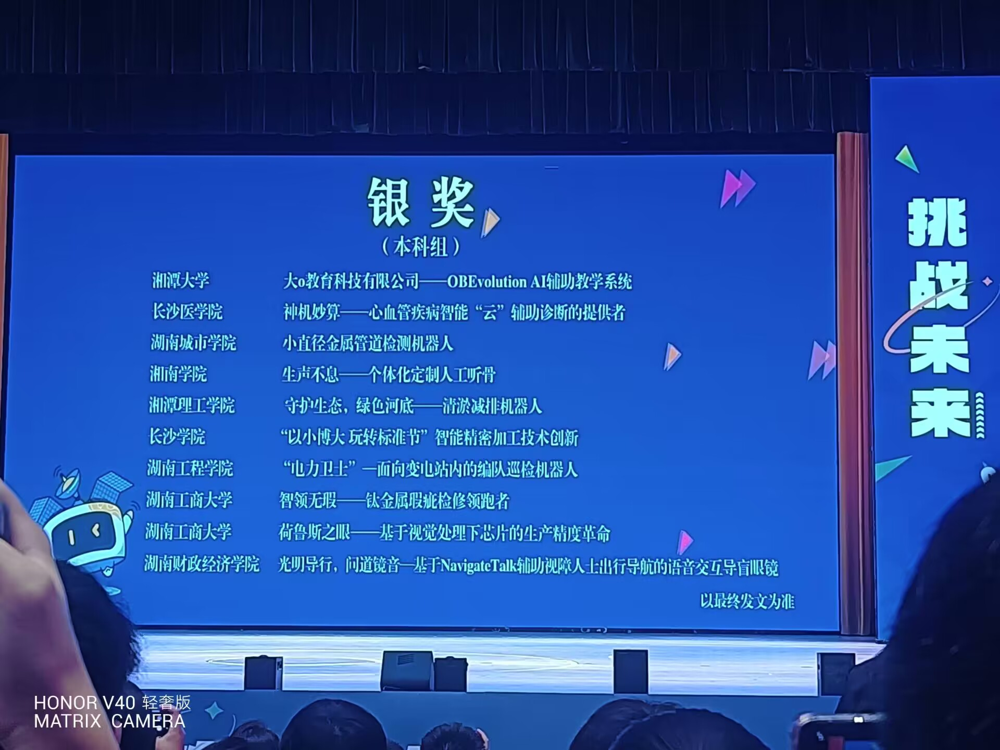 |
| 互联网+技术大赛 | 参与互联网技术相关竞赛 |  |
| AI科技竞赛 | 参与人工智能科技竞赛 |  |
| 机器创新竞赛 | 参加机器创新相关竞赛 | 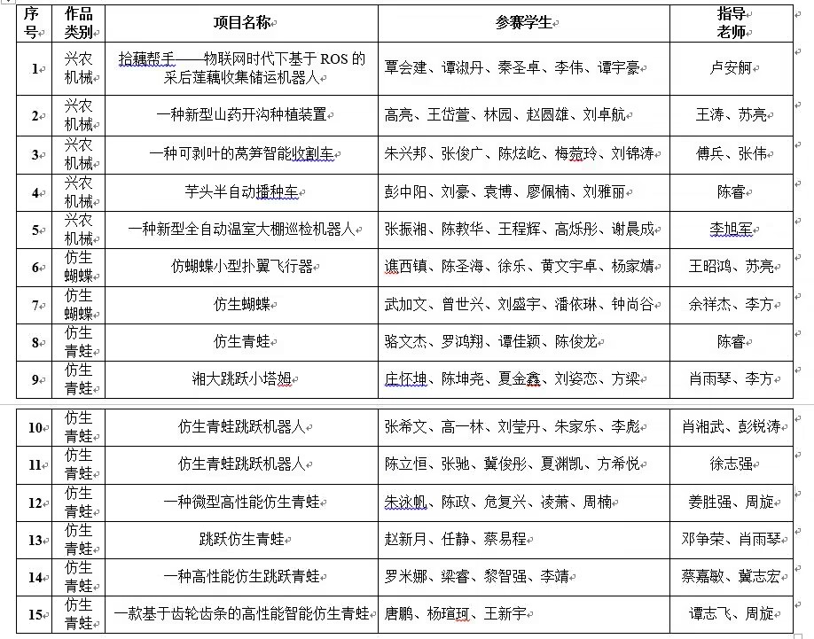 |
| ICAN 创新创业大赛 | 参与 ICAN 大赛 | 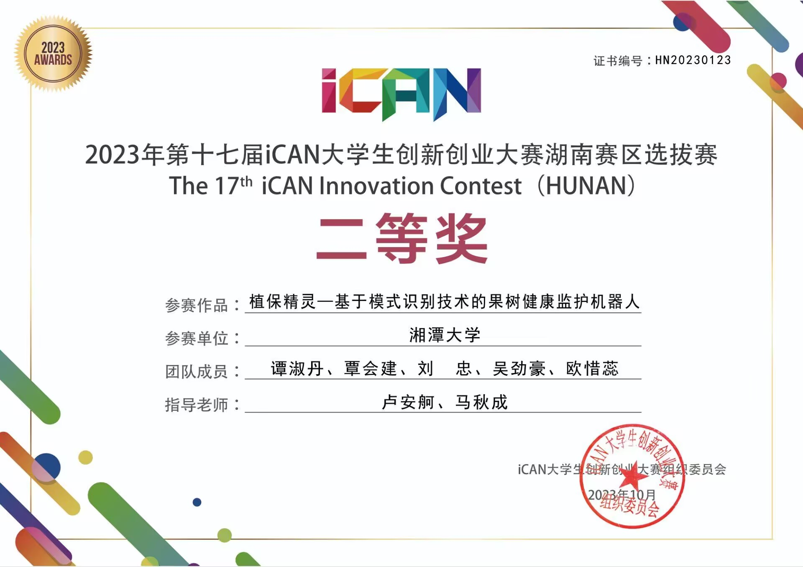 |
| 大创项目 | 大学生创新创业训练计划项目 | 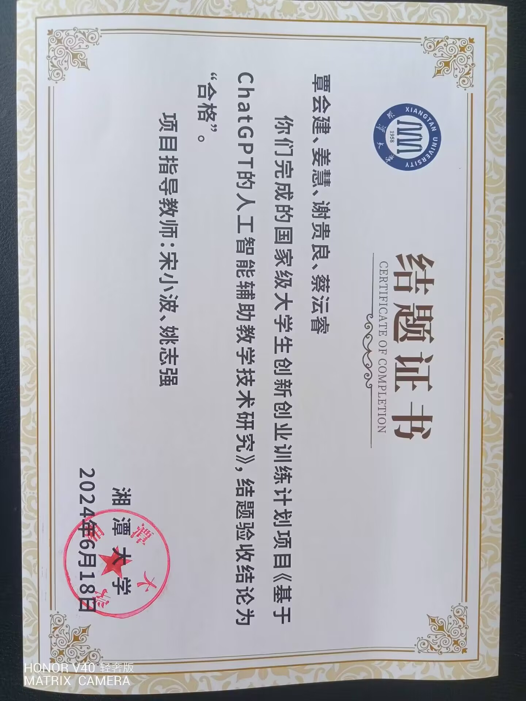 |
| 3D 设计 | 参与三维设计相关项目 | 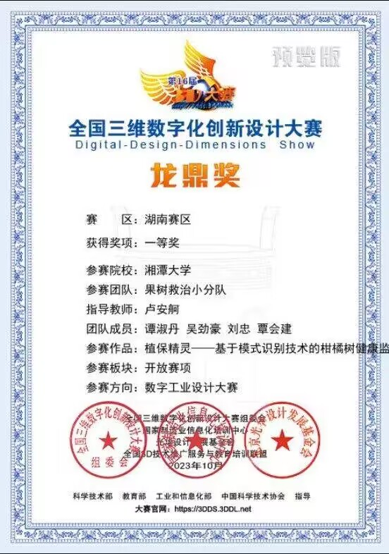 |
| 市场分析研究 | 开展市场分析与研究 | 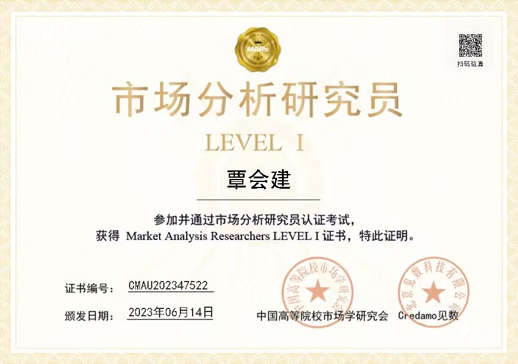 |
| 大学生职业发展与就业竞赛 | 参与职业发展竞赛 |  |

#### 荣誉与身份

| 荣誉 | 说明 | 证明 |
|------|------|------|
| 挑战杯银奖 | 挑战杯竞赛获奖证书 |  |
| 人工智能领域新星创作者 | AI 领域创作认可 | 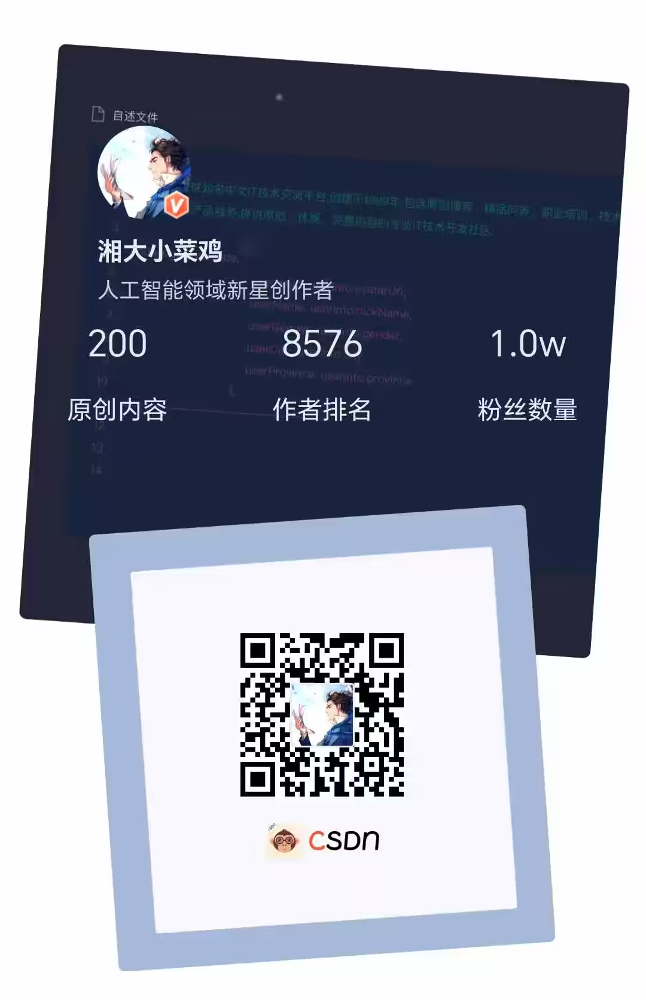 |
| EI 论文 | 发表 EI 检索论文（无指导老师） | 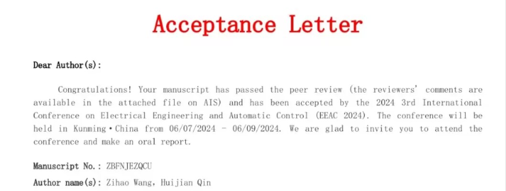 |
| 重点实验室成员 | 加入学校重点实验室 | 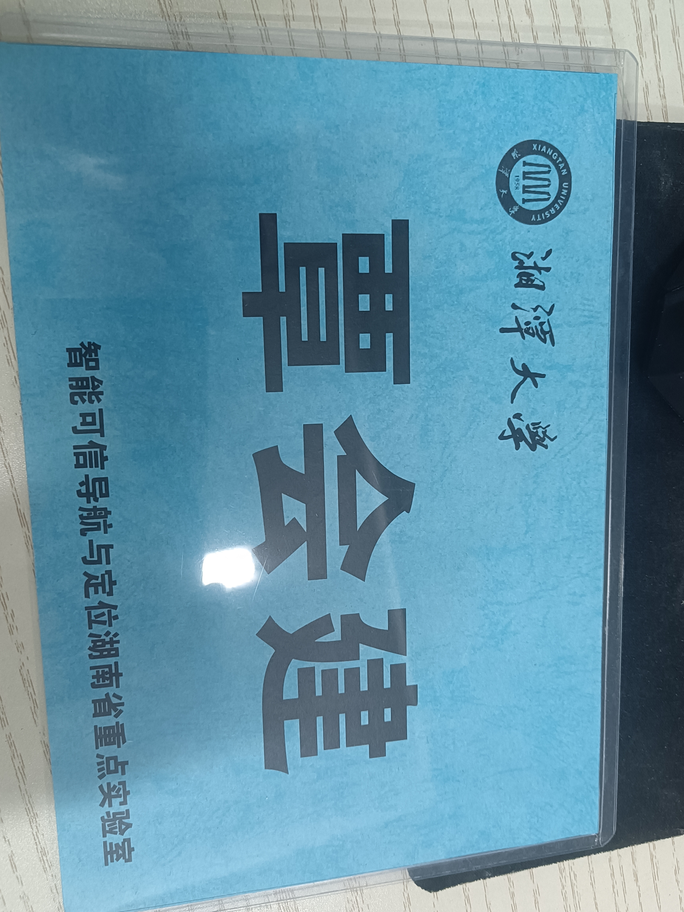 |
| 物联网成员 | 参与物联网相关项目/团队 | 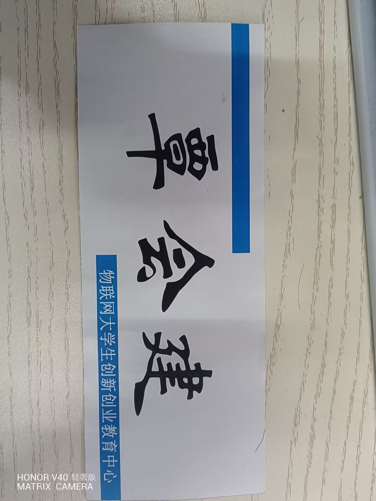 |
| 荣誉-1 | 综合荣誉 |  |

#### 培训与思想提升

| 培训 | 说明 | 证明 |
|------|------|------|
| 入党积极分子 | 参加入党积极分子培训 | 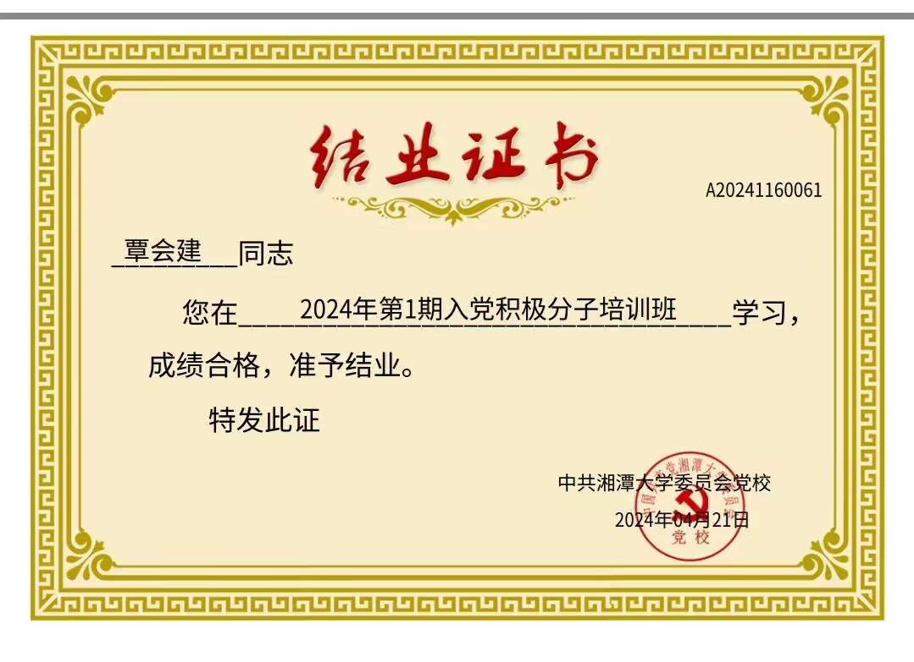 |
| 文体竞赛 | 参与文体类竞赛活动 |  |
| 荣誉-17 | 其他荣誉 |  |

### 参与培训与思想提升

大学期间的各种培训是培养学生的重要途径之一。尤其是积极分子培训，旨在提升学生的思想境界和社会责任感。参加这些培训的初衷不仅是为了加分，更是为了思想的提升和内心的净化。通过这些培训，我逐渐感受到，大学不仅是获取知识的场所，更是培养思想和品格的熔炉。

### 大学的核心与人才培养

经历了三年的大学生活后，我开始重新审视大学的核心价值和人才培养的目标。大学的本质是什么？是教书育人，还是培养普通人？在当前AGI时代，大学的传统教育模式是否还能满足社会对高素质人才的需求？

通过参加多次关于AGI的学术报告，我意识到大学教育正在面临前所未有的挑战。学生为了拿到毕业证书，不得不参加课程，这让大学逐渐变成了一个服务业，学生是消费者，而教职员工则成了服务员。

这种现象让我更加清楚地认识到，大学教育正在远离其教育的本质，逐渐被时代所抛弃。如果我们希望真正成才，就必须充分利用好学校和校外的资源，将理论与实践结合，才能在未来的竞争中占据主动。

### 构建自我道与未来规划

在思考未来发展方向的过程中，我逐渐形成了自己的"道"。这个"道"是一种个人成长的策略。在保持学业GPA中等水平的同时，我更加注重技术的提升。无论是软件编程还是硬件运维，我都努力掌握各种技能，并用这些技能去解决实际问题。

我认识到，平凡并不等于平庸。在这个应试教育主导的社会，许多成功者并不是通过传统的教育路径走向成功的。因此，我决定走自己的路，创建自己的"道"，不断提升自己的综合素质和实践能力。

### 大学教育的未来与个人定位

随着AGI时代的到来，大学教育的职能正在逐渐被取代。我们需要重新审视大学的定位和自身的未来发展。大学不仅是获取知识的地方，更是塑造自我、提升自我能力的平台。通过不断反思和调整，我逐渐找到了自己的定位，明确了未来的方向。

最终，我决定将更多的时间投入到技术的提升和实践中去。无论是参加比赛还是参与培训，我都会以提升自我为最终目标，而不仅仅是为了获取外在的奖励。同时，我也意识到，个人的成长和国家的未来息息相关。只有在不断提升自我的同时，为国家做出贡献，才能真正实现个人的价值。

### 总结

大三这一年，尽管我并没有做出惊天动地的成就，但通过反思和总结，我逐渐认识到大学生活的真正意义。无论是参加比赛、参与公益，还是接受培训，最终的目的都是为了提升自我和服务社会。在未来的日子里，我将继续坚持自己的"道"，不断提升自己的综合素质，努力为国家的未来做出贡献。毕竟，功成不必在我，功成必定有我。
